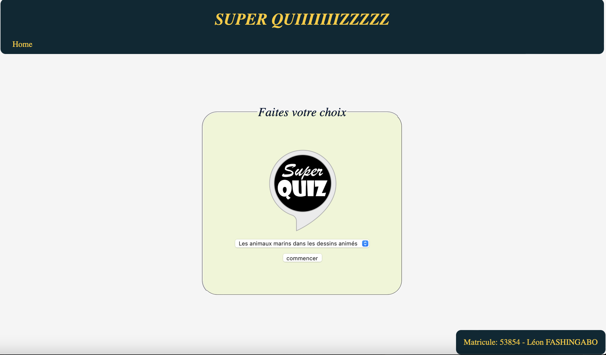
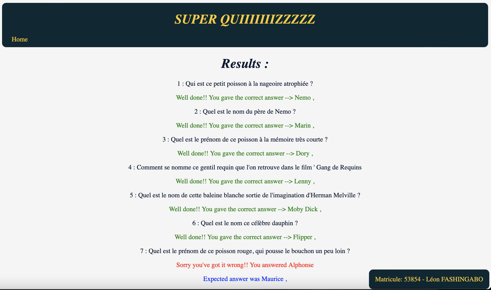

# Super Quiiiiizzzz

Web project developped while learning web development at H2B-Haute Ecole Bruxelles-Brabant, ESI (Ecole Supérieure de l'Informatique), first grade

Web development tecnologies as Html, CSS,  JavaScript and Jquery are highlightned

It is a website that suggests some quiz.
It starts with a page that suggests to choose a quizz from a serie of quiz.

Once a quizz is chosen, a countdown of 3 seconds is launched before the quiz is displayed.

## Types of Quiiiiizzzz

There are 3 types of quiz depending on the choice made:

1. The first two types « Les animaux marins dans les dessins animés » and « De quel jeu provient cette image ? » require only one answer.

2. The third type « Les couples de dessins animés » requires a couple answer (2 choices).

3. The third type  « La matière de Webg2 »requires multiple choices of answers.

## End of game

The results page displays the the right and wrong answers
In case of wrong answers, the correct answer is displayed aside as correction

